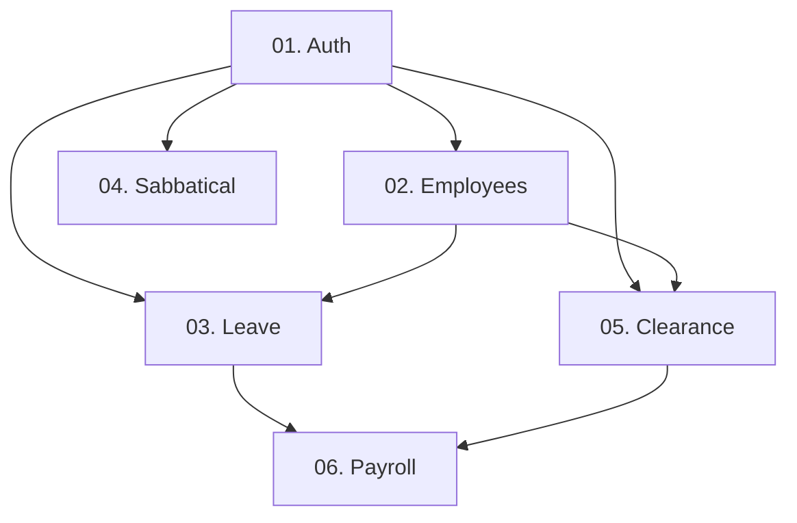

# HRMS Postman Collection Structure Guide

This document defines the recommended Postman collection structure for the HR Management System (HRMS). It serves as a blueprint for backend developers, QA engineers, and HR stakeholders to ensure consistent and comprehensive API testing.

## collection Folder Structure

The collection is organized by business modules, with requests ordered to reflect logical data flow and dependencies.

### 01. Authentication & Identity
**Testing Purpose**: Verify secure access, token management, and session lifecycle.
- `POST Register` - Create a new user account.
- `POST Login` - Exchange credentials for an access and refresh token.
- `GET Get Current User (Me)` - Verify the identity of the authenticated user.
- `POST Refresh Token` - Obtain a new access token using a valid refresh token.
- `POST Logout` - Invalidate tokens and end the session.

### 02. Employee Management
**Testing Purpose**: Manage core employee profiles and personal information.
- `GET Get Employee Details` - Retrieve full profile by ID.
- `PATCH Update Employee` - Modify specific employee attributes (e.g., contact info).

### 03. Leave Management
**Testing Purpose**: Validate the lifecycle of leave requests from submission to approval.
- `POST Create Leave Request` - Submit a new request for time off.
- `GET Get My Requests` - List requests submitted by the current user.
- `GET Get Pending Requests` - (Manager Role) View requests awaiting approval.
- `PATCH Approve Leave Request` - (Manager Role) Confirm a request.
- `PATCH Reject Leave Request` - (Manager Role) Deny a request.

### 04. Sabbatical Management
**Testing Purpose**: Handle long-term research and academic leave workflows.
- `POST Create Sabbatical Request` - Initiate a sabbatical application.
- `GET List Sabbatical Requests` - View historical and active requests.
- `PATCH Approve Sabbatical Request` - Finalize the sabbatical approval.
- `PATCH Reject Sabbatical Request` - Deny a sabbatical application with a mandatory comment.

### 05. Clearance Process
**Testing Purpose**: Manage the multi-unit clearance workflow for departing employees.
- `POST Initiate Clearance` - Start the exit process for an employee.
- `GET Get Clearance Status` - Check progress across all required units.
- `GET List Pending Unit Checks` - (Unit Head) View items to be cleared in a specific unit.
- `PATCH Approve Unit Check` - (Unit Head) Mark a specific unit as cleared.
- `PATCH Reject Unit Check` - (Unit Head) Denote an outstanding obligation.

### 06. Payroll Integration
**Testing Purpose**: Ensure accurate delivery of HR data to the Finance system.
- `GET Export Payroll Data` - Fetch the calculated payable days and employee list for the current period.

---

## Testing Guide

### 1. Unit Testing
- **Focus**: Individual endpoints.
- **Method**: Test each request in isolation with valid and invalid payloads.
- **Goal**: Verify status codes (200, 201, 400, 401, 404) and response body structure.

### 2. Integration Testing
- **Focus**: Inter-endpoint communication and data persistence.
- **Method**: Run a sequence of requests (e.g., Create Leave -> Verify it appears in "My Requests").
- **Goal**: Ensure changes in one endpoint are correctly reflected in others.

### 3. Flow-Based (E2E) Testing
- **Focus**: Real-world business scenarios.
- **Method**: Use Postman Environment Variables to pass data between requests.
    - **Example**: `Login` -> Save `token` -> `Create Leave Request` -> `Approve Leave Request`.
- **Goal**: Validate that complex workflows (like Clearance) work across different user roles.

---

## Module Dependencies

To perform testing effectively, observe the following execution order:

1. **Auth First**: Almost all requests require the `Authorization` header. Run the Login request first and extract the `accessToken`.
2. **Employee Context**: Many modules require an active employee record. Ensure employee IDs exist before testing Leave or Clearance.
3. **Payroll Latency**: Payroll data is dependent on the state of Leaves and Clearance. These should be populated before testing the Export endpoint.
